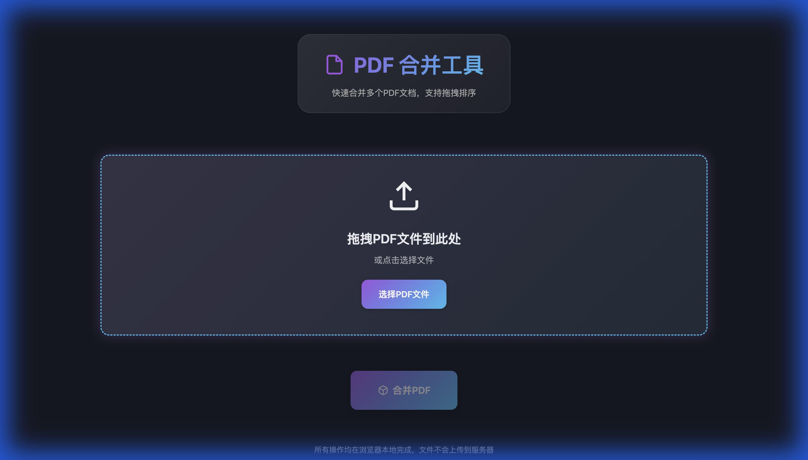

# PDF 合并工具 | PDF Merger

[English](#english) | [中文](#中文)

---

## 中文

一个现代化的浏览器端PDF文档合并工具，完全在客户端运行，保护您的隐私。

### ✨ 主要特性

- 🎨 **现代化界面** - 深色主题，玻璃态效果和流畅动画
- 📁 **拖拽上传** - 支持拖拽文件或点击选择
- 🔄 **自由排序** - 拖动文件卡片重新排列合并顺序
- ⚡ **快速合并** - 使用PDF-lib库实现高效PDF合并
- 🔒 **隐私保护** - 所有操作本地完成，文件不上传到服务器
- 💾 **自定义文件名** - 合并前可指定输出文件名
- 📱 **响应式设计** - 完美适配桌面和移动设备

### 🚀 快速开始

#### 在线使用

直接在浏览器中打开 `index.html` 文件即可使用。

#### 本地服务器

```bash
# 克隆仓库
git clone https://github.com/YOUR_USERNAME/pdf-merger.git
cd pdf-merger

# 使用Python启动本地服务器
python3 -m http.server 8000

# 在浏览器中访问
# http://localhost:8000
```

### 📖 使用说明

1. **添加PDF文件**
   - 方法一：点击"选择PDF文件"按钮
   - 方法二：拖拽PDF文件到上传区域

2. **调整顺序**（可选）
   - 拖动文件卡片左侧的拖拽手柄
   - 上下移动调整合并顺序

3. **合并PDF**
   - 点击"合并/保存PDF"按钮
   - 输入自定义文件名
   - 等待处理完成

4. **下载结果**
   - 合并完成后自动下载到本地

### 🛠️ 技术栈

- **HTML5** - 语义化标记
- **CSS3** - 现代样式和动画
- **Vanilla JavaScript** - 无框架依赖
- **PDF-lib** - 客户端PDF处理库

### 📁 项目结构

```
pdf-merger/
├── index.html          # 主HTML文件
├── style.css           # 样式表
├── app.js              # JavaScript逻辑
├── README.md           # 项目文档
└── LICENSE             # MIT许可证
```

### 🌟 功能演示

#### 上传文件


#### 文件列表


### 🔐 隐私说明

本工具完全在浏览器中运行，所有PDF文件处理都在您的设备上完成，不会上传到任何服务器。您的文档完全私密和安全。

### 📝 开发

本项目使用纯HTML/CSS/JavaScript开发，无需构建步骤。直接编辑文件即可。

### 🤝 贡献

欢迎提交Issue和Pull Request！

1. Fork本仓库
2. 创建特性分支 (`git checkout -b feature/AmazingFeature`)
3. 提交更改 (`git commit -m 'Add some AmazingFeature'`)
4. 推送到分支 (`git push origin feature/AmazingFeature`)
5. 开启Pull Request

### 📄 许可证

本项目采用 MIT 许可证 - 查看 [LICENSE](LICENSE) 文件了解详情

### 👨‍💻 作者

您的名字 - [@yourhandle](https://github.com/YOUR_USERNAME)

---

## English

A modern browser-based PDF document merger that runs entirely on the client side, protecting your privacy.

### ✨ Features

- 🎨 **Modern Interface** - Dark theme with glassmorphism effects and smooth animations
- 📁 **Drag & Drop** - Support file dragging or click to select
- 🔄 **Free Sorting** - Drag file cards to rearrange merge order
- ⚡ **Fast Merging** - Efficient PDF merging using PDF-lib
- 🔒 **Privacy Protection** - All operations completed locally, files not uploaded
- 💾 **Custom Filename** - Specify output filename before merging
- 📱 **Responsive Design** - Perfect for desktop and mobile devices

### 🚀 Quick Start

#### Online Use

Simply open the `index.html` file in your browser.

#### Local Server

```bash
# Clone the repository
git clone https://github.com/YOUR_USERNAME/pdf-merger.git
cd pdf-merger

# Start local server with Python
python3 -m http.server 8000

# Visit in browser
# http://localhost:8000
```

### 📖 Usage

1. **Add PDF Files**
   - Method 1: Click "Select PDF Files" button
   - Method 2: Drag PDF files to upload area

2. **Adjust Order** (Optional)
   - Drag the handle on the left side of file cards
   - Move up and down to adjust merge order

3. **Merge PDFs**
   - Click "Merge/Save PDF" button
   - Enter custom filename
   - Wait for processing to complete

4. **Download Result**
   - Automatically downloads after merging completes

### 🛠️ Tech Stack

- **HTML5** - Semantic markup
- **CSS3** - Modern styles and animations
- **Vanilla JavaScript** - No framework dependencies
- **PDF-lib** - Client-side PDF processing library

### 📁 Project Structure

```
pdf-merger/
├── index.html          # Main HTML file
├── style.css           # Stylesheet
├── app.js              # JavaScript logic
├── README.md           # Project documentation
└── LICENSE             # MIT License
```

### 🔐 Privacy Notice

This tool runs entirely in your browser. All PDF file processing is completed on your device and no files are uploaded to any server. Your documents are completely private and secure.

### 📝 Development

This project is built with pure HTML/CSS/JavaScript and requires no build steps. Simply edit the files directly.

### 🤝 Contributing

Issues and Pull Requests are welcome!

1. Fork the repository
2. Create a feature branch (`git checkout -b feature/AmazingFeature`)
3. Commit your changes (`git commit -m 'Add some AmazingFeature'`)
4. Push to the branch (`git push origin feature/AmazingFeature`)
5. Open a Pull Request

### 📄 License

This project is licensed under the MIT License - see the [LICENSE](LICENSE) file for details

### 👨‍💻 Author

Your Name - [@yourhandle](https://github.com/YOUR_USERNAME)

---

⭐ If you find this project helpful, please give it a star!
